# GitIgnite

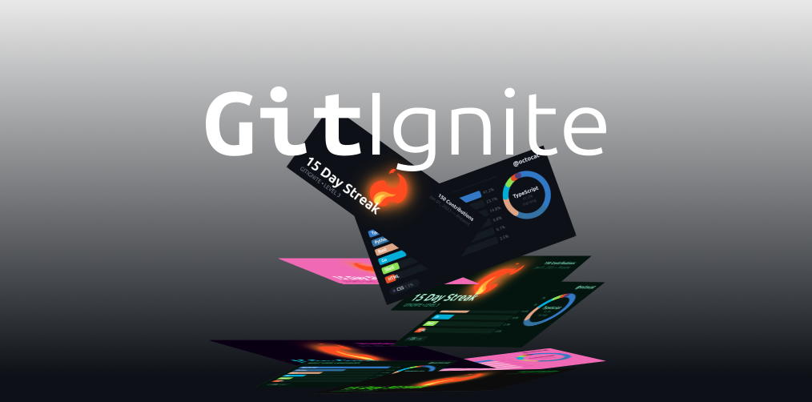

<div align="center" style="margin-top: 30px">

[](https://github.com/Edmendez-dev/git-ignite/releases)
[](./LICENSE)
[](https://github.com/Edmendez-dev/git-ignite)
[](https://nodejs.org/)


GitIgnite is a GitHub Action that automatically generates animated SVG cards to display profile statistics, such as your **day streak** and your **top languages**, using workflows.

[What is GitIgnite?](#what-is-gitIgnite?) • [Main Features](#main-features) • [Themes](#themes) • [How to Use](#how-to-use) • [Inputs](#inputs) • [Outputs](#outputs) • [Generated Files](#generated-files) • [Project Structure](#project-structure) • [Development](#development) • [Documentación extra](#documentación-extra) • [Contributing](#contributing) • [Guidelines](#guidelines) • [License](#license) • [Author](#author) • [Acknowledgments](#acknowledgments)

</div>

## What is GitIgnite?

GitIgnite queries GitHub data (contributions and languages), calculates useful metrics, and generates two SVG cards:

1. **Streak Card**: current streak, intensity level, and cumulative contributions.
2. **Language Card**: top languages ​​with bars and an animated donut chart.

It's ideal for profile READMEs, personal repositories, or dashboards based on GitHub Actions.

## Main Features

- Streak calculation with continuity logic.
- Top languages ​​by actual usage (bytes added).
- 6 ready-to-use themes.
- Lightweight, embeddable animated SVGs in the README.
- Simple integration into existing workflows.

## Themes

GitIgnite includes six themes designed for different personal branding styles:

- **`Classic`**: A professional, clean, and balanced GitHub-style look.
- **`Neon`**: A cyberpunk aesthetic with high contrast and visual energy.
- **`Obsidian`**: High-end, dark minimalism with elegant details.
- **`Emerald`**: Intense green with a fresh and modern feel.
- **`Pink`**: Vibrant, creative, and full of personality.
- **`Terminal`**: A retro-hacker style, perfect for command-line enthusiasts.

### Classic

<div align="center">
  
  
</div>

### Neon

<div align="center">
  
  
</div>

### Obsidian

<div align="center">
  
  
</div>

### Emerald

<div align="center">
  
  
</div>

### Rose

<div align="center">
  
  
</div>

### Terminal

<div align="center">
  
  
</div>

## How to Use

Para mostrar estas métricas en tu perfil de GitHub, usa tu repositorio especial de perfil:

- `github.com/tu-usuario/tu-usuario`

Ejemplo real:

- `github.com/octocat/octocat`

En ese repositorio, puedes:

1. Ejecutar GitIgnite por workflow.
2. Guardar los SVGs generados (por ejemplo en `stats/`).
3. Insertar las imágenes en tu `README.md` de perfil.

## Ejemplo de workflow para `github.com/tu-usuario/tu-usuario`

Guárdalo como `.github/workflows/gitignite.yml`:

```yml
name: GitIgnite Profile Stats

on:
  schedule:
    - cron: "0 */12 * * *"
  workflow_dispatch:

jobs:
  generate-stats:
    runs-on: ubuntu-latest
    steps:
      - name: Checkout repository
        uses: actions/checkout@v4

      - name: Generate GitIgnite cards
        uses: Edmendez-dev/git-ignite@v1
        with:
          gh_token: ${{ secrets.GITHUB_TOKEN }}
          user_name: ${{ github.repository_owner }}
          theme: classic
          output_path: stats

      - name: Upload SVGs as Artifacts
        uses: actions/upload-artifact@v4
        with:
          name: gitignite-stats
          path: stats/*.svg
```

Luego en tu `README.md` de perfil:

```md
<div align="center">

</div>
```

## Inputs

| Input         | Required | Default   | Description                              |
| ------------- | -------- | --------- | ---------------------------------------- |
| `gh_token`    | Yes      | -         | GitHub token to query statistics.        |
| `user_name`   | yes      | -         | GitHub user to analyze.                  |
| `theme`       | No       | `classic` | Output visual theme.                     |
| `show_levels` | No       | `true`    | Support for displaying intensity levels. |
| `output_path` | No       | `stats`   | Output directory for SVGs.               |

## Outputs

- `streak`: Current streak (days).
- `level`: Calculated intensity level.
- `svg`: SVG content of the streak card.
- `languages_svg`: SVG content of the languages ​​card.

## Generated Files

By default, the following are created:

- `stats/ignite-streak.svg`
- `stats/ignite-languages.svg`

## Project Structure

```txt
git-ignite/
├─ action.yml
├─ src/
│  ├─ index.ts
│  ├─ data/
│  │  └─ language-colors.json
│  ├─ engine/
│  │  ├─ calculator.ts
│  │  ├─ github.ts
│  │  ├─ languages.ts
│  │  └─ types.ts
│  └─ renderer/
│     ├─ streak-builder.ts
│     ├─ languages-builder.ts
│     ├─ flame-frames.ts
│     └─ themes/
│        ├─ index.ts
│        ├─ classic.ts
│        ├─ neon.ts
│        ├─ obsidian.ts
│        ├─ emerald.ts
│        ├─ rose.ts
│        └─ terminal.ts
├─ assets/
├─ dist/
└─ test/
   └─ test-local.ts
```

## Development

### Requirements

- Node.js 20+
- npm

### Commands

```bash
npm install
npm run build
npm run format
npm run lint
```

### Adding New Features

## Contributing

Contributions are welcome! Please follow these steps:

1. **Fork the repository**
2. **Create a feature branch**
   ```bash
   git checkout -b feature/amazing-feature
   ```
3. **Make your changes** with clear commit messages
4. **Push to your fork**
   ```bash
   git push origin feature/amazing-feature
   ```
5. **Open a Pull Request** with a detailed description

### Guidelines

- Write clean, commented code
- Add tests for new functionality
- Update documentation
- Follow existing code patterns

## License

This project is licensed under the MIT License - see the [LICENSE](LICENSE) file for details.

## Author

**Eduardo Méndez**  
GitHub: [@Edmendez-dev](https://github.com/Edmendez-dev)

## Acknowledgments

- GitHub Actions por la infraestructura de automatización.
- GitHub GraphQL API por la fuente de datos de contribuciones y lenguajes.
- Comunidad open source por inspirar mejoras continuas en tooling de perfiles.

<div align="center">

**⭐ If you find this project helpful, please consider giving it a star!**

[Report Bug](https://github.com/Edmendez-dev/git-ignite/issues) • [Request Feature](https://github.com/Edmendez-dev/git-ignite/issues)

</div>
